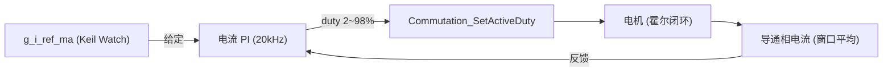

# PI 电流环设计文档

> 项目：`D:\WS_L\ws_L_v.1.0.2`（HC32F460 六步方波 BLDC 学习板）
> 日期：2026-08-06
> 状态：**设计稿（待评审）**，确认后再进入实现

---

## 1. 背景与目标

### 1.1 现状
- 有感霍尔六步换相已可运行：开环（mode 1/2）、霍尔闭环（mode 3/4）、速度 PID（mode 8/9）。
- 三相电流采样（`ws/I.c`）和 BEMF（`ws/Bemf.c`）目前都是**观察者模式**，只采集不上报控制。
- 现有 `Utils/dev_pid.c/.h` 已实现：P/I/D 独立使能、抗积分饱和、输出限幅、`update_ms` 节流、全字段 volatile（Keil Watch 可在线调参）。

### 1.2 目标（本期）
1. 增加**电流内环（PI）**，形成 `速度环 → 电流环 → 占空比` 的级联控制（学习用）。
2. 获得**限流保护**能力（目前转动无任何过流保护）。
3. **不改变现有 mode 0~9 的行为**；新功能以"新增 + 兼容"方式落地。

### 1.3 非目标（本期不做）
- 无感 BEMF 换相、FOC、SVPWM。
- 新建另一套 PID 模块（沿用并小步增强 `dev_pid`，避免两套实现并存）。

---

## 2. 现状核对（代码事实，已逐一验证）

### 2.1 电流检测（`ws/I.c`）
- ADC1 SEQ_B 在 PWM 峰值触发，EOCB 中断 **20kHz**（= MOTOR_PWM_FREQ_HZ），每拍更新 `g_i_iu_ma / iv / iw`（**无滤波瞬时 mA**，`I.c:305`）。
- `g_i_*_filt / disp` 是 Biquad 滤波值：系数按 fs=50kHz 设计，实际采样 20kHz → **真实 fc≈80Hz、相位滞后大，禁止用于控制**，只作显示。
- `I_RegisterCallback()` 已存在，回调在 **EOCB ISR 上下文**执行（`I.c:541`）——正好作为电流环挂载点。

### 2.2 占空比施加路径（`ws/dev_comm_runner.c` / `dev_commutation.c`）
- `CommRunner_SetDuty()` **只存 `s_duty`**，真正写 PWM 发生在**换相沿**（`runner_on_hall_step` / `open_loop_tick` 里的 `Commutation_Step`）。
- 结论：电流环若只改 `s_duty`，低速时一个 step 长达几十 ms，**等于开环**。必须新增"step 内在线更新占空比"的接口（见 §3.4）。

### 2.3 PWM 影子寄存器（`Adp/tmr4_pwm.c`）——已确认✅
- 周期 CPSR 缓冲：`TMR4_PeriodBufCmd(ENABLE)`（`tmr4_pwm.c:221`）。
- 比较值 OCCR / 比较模式 OCMR 缓冲：`Shadow_ApplyOC()` 统一设为 `TMR4_OC_BUF_COND_PEAK`（`tmr4_pwm.c:60-71`）。
- DDL 实现：`TMR4_OC_SetCompareValue()` 直写 OCCR，但缓冲模式下硬件在**下一个 PWM 峰值**才搬运生效。
- 结论：**新占空比在 20kHz 下 ≤50µs 内无毛刺生效**，电流环无需处理影子寄存器。

### 2.4 Timer6 µs 时基（`Adp/timer6_timebase.c`）——现成✅
- PCLK0 200MHz ÷ 64 = **3.125MHz（0.32µs 分辨率）**。
- `Timer6_Timebase_UpdateTimestamp()` / `GetTimestamp()` 提供 µs 时间戳；Hall ISR、CommRunner 已在用。
- ⚠️ **不要改动 Timer6 的 Period**：`GetDelta()/UpdateTimestamp()` 的回绕计算硬编码了 `65536u/0x10000u`（`timer6_timebase.c:88,120`），改 Period 必须同步改常量，风险大。

### 2.5 校准流程（`ws/dev_comm_runner.c`）
- 标准流程：**mode 5（标定）→ mode 6（CW）/ mode 7（CCW）**。前提：电机空载能自由转、`g_calib_status==2`、`g_calib_hall_seen[1..6]` 全为 1、`g_calib_table[1..6]` 为 0~5 不重复。
- **概念澄清**：校准表是 `Hall码 → 换相步`（`g_calib_table[hall]=step`），**不是**"每步哪一相导通"。哪相导通由 `dev_commutation.c` 的固定状态表 `s_states[6][6]` 决定（step0=UH+VL、step1=UH+WL……）。
- 对电流环的含义：反馈相选择**查固定状态表**（找 `M_HIGH/D_PWM` 通道），校准表只保证 `g_scope_step` 可信。

---

## 3. 设计决策（A 方案：复用 EOCB ISR + Timer6 dt）

### 3.1 电流环节拍：复用 ADC1 EOCB ISR（与 PWM 1:1，20kHz）
- 挂载点：`I_RegisterCallback()`（20kHz 每拍调用，ISR 上下文）。
- 电流环频率 = PWM = ADC（由 `MOTOR_PWM_FREQ_HZ` 决定）：每次 EOCB 都执行 PI（1:1），反馈用 ~200µs 滑窗平均。
- 为什么不用主循环 / 新开 200µs 中断：
  - 主循环含 VOFA+ 16 通道发送、BEMF EMA、日志，执行时间不确定，控制周期会抖动；
  - 新开 Timer6 200µs 中断需改 Period + 修 wrap 常量 + NVIC 注册，改动面大且会动到 Hall 依赖的共享时基（不推荐）。

### 3.2 dt 来源：Timer6 µs 实测
```c
Timer6_Timebase_UpdateTimestamp();
uint64_t now = Timer6_Timebase_GetTimestamp();
uint32_t dt_us = (uint32_t)(now - s_last_us);
s_last_us = now;
```
- 采样时刻由硬件触发保证（PWM 峰值，抗开关噪声）；dt 用于控制算法的时间步长（积分/微分），两者各司其职。
- 用实测 dt 而非固定值：Hall ISR 优先级更高会插队，实际控制间隔有抖动，实测才准确。

### 3.3 反馈相选择
- 按 `g_scope_step` 查 `s_states`，取 `M_HIGH/D_PWM` 通道（导通相）的电流。
- 窗口平均：~200µs 时间窗口（点数随频率自适应：10k=2、20k=4、25k=5、50k=10），每次采样更新、每次输出，平滑换相纹波。
- 可选：换相后前 2~3 拍做 blanking（跳过），避开换相尖峰（实现时验证是否需要）。
- 不用三相平均（浮空相≈0，换相沿有尖峰）。

### 3.4 占空比在线更新：新增 `Commutation_SetActiveDuty()`
```c
void Commutation_SetActiveDuty(uint8_t state, float duty_pct);
```
- 行为：占空比 clamp 2%~98% → 按 `s_states[state]` 找 `D_PWM` 通道 → `TMR4_PWM_SetDutyFloat(ch, duty)` → **同步 `s_last_ch_duty[ch]` 缓存**。
- 缓存同步是必须的：否则 `Commutation_Step` 的懒更新逻辑会误判"占空比没变"而跳过更新，导致硬件和缓存不一致。
- 要求：ISR 内调用，保持精简（无 printf、无阻塞）。
- 生效延迟：≤1 个 PWM 周期（20kHz 下 ≤50µs），远小于控制周期，视为即时。

### 3.5 电流环 ISR 数据流（示意）


---

## 4. dev_pid 增强（①~③，接口兼容）

### 4.1 `pid_state_t` 新增字段
```c
typedef struct {
    pid_config_t *cfg;
    float         integral;
    float         prev_measurement;
    float         last_output;
    bool          first_sample;
    uint32_t      last_update_ms;   /* 现有，保留 */
    /* ---- 新增 ---- */
    float         p_term;           /* 最近一次 P 项输出（只读观测） */
    float         i_term;           /* 最近一次 I 项输出（只读观测） */
    float         d_term;           /* 最近一次 D 项输出（只读观测） */
    uint32_t      last_update_us;   /* µs 路径节流累积 */
} pid_state_t;
```

### 4.2 `pid_config_t` 新增字段
```c
typedef struct {
    /* ...现有字段不变... */
    volatile float i_term_max;      /* I 项输出独立限幅（0 = 不启用；启用后 i_term = clamp(ki*integral, ±i_term_max)） */
} pid_config_t;
```
- 默认 `i_term_max = 0` → 行为与现在完全一致。

### 4.3 新增 `PID_UpdateUs()`
```c
float PID_UpdateUs(pid_state_t *pid, float setpoint, float measurement, uint32_t dt_us);
```
- 内部统一 µs：
  - `dt_s = dt_us / 1e6`，clamp 到 1s（防调试器暂停后积分爆掉）。
  - 节流：`pid->last_update_us += dt_us; if (update_ms > 0 && last_update_us < update_ms*1000) return last_output; else last_update_us = 0;`（首拍立即执行，与现有一致）。
  - P / I / D 计算与现有 `PID_Update` 完全一致（P/I 用误差、D 用测量值微分、积分抗饱和、输出 clamp）。
  - `i_term_max > 0` 时对 I 项输出独立 clamp。
  - 每次执行后记录 `p_term / i_term / d_term`。
- 现有 `PID_Update()`（ms）保留，内部转成 µs 调同一核心（用 `tickTimer` 算 dt_us），**速度环行为不变**。

### 4.4 兼容性
- `dev_comm_runner.c` mode 8/9、`main.c` 的 `g_pid_cfg`、Keil Watch 变量**全部不动**。
- 纯新增字段/API；旧结构体按字段名初始化（如 `g_pid_cfg` 用指定初始化器）不受影响。

---

## 5. 电流环集成（分两阶段，先做 Stage 1）

### 5.1 Stage 1：独立电流环模式（学习调参）
- 新增 `comm_runner_mode_t`：`COMM_RUNNER_CURLOOP_FW = 10`（电流环 only）与 `COMM_RUNNER_CASCADE_FW = 11`（宏拓扑级联）。
- 行为：**开环阶段为定时强拖**，进入时用校准表 `g_calib_table` 对准起始步，方向与校准相反（对齐硬编码正转方向）；ramp 结束后切 `g_calib_cw_table` 闭环 + **电流环接管占空比**，给定为 Keil Watch 全局 `g_i_ref_ma`（有符号 mA）。
- 新增全局：`volatile float g_i_ref_ma = 800.0f;`（cur_loop.c，Keil Watch 可改）。



### 5.2 Stage 2：级联（另行评审，本期可只做 Stage 1）
- mode 8/9 速度环输出由"占空比"改为"电流给定 `i_ref`"，电流环输出占空比。
- 依赖 Stage 1 电流环调稳；是否本期做在 §9 待定。

### 5.3 观测变量（JScope/VOFA 复用现有机制）
- `g_scope_i_ref`、`g_scope_i_fb`、`g_scope_i_duty`、`g_scope_i_err`（volatile float，电流环回调里更新）。

### 5.4 初始参数建议（学习起点，非最终值）
- `Kp = 0.1`（% 占空比 / mA），`Ki = 0.1`（% / (mA·s)），`Kd` 关闭，`update_ms = 0`（=随 PWM 频率全速，见 `MOTOR_PWM_FREQ_HZ`）。
- `output_min = 2.0`、`output_max = 98.0`、`integral_max = 50.0`、`i_term_max = 10.0`（I 项贡献 ≤ ±10%）。

---

## 6. 安全与异常
- 输出限幅 2%~98% + `i_term_max` 独立限幅，防积分顶满。
- 堵转检测沿用现有 `hall_3ch_is_stalled()`（堵转 → STOP）。
- ISR 内**禁止** printf / 串口 / 阻塞；日志与 VOFA 数据留在 main 循环。
- 与 Hall ISR（优先级更高）竞争：换相沿写占空比优先，电流环下一拍自动校正；`Commutation_SetActiveDuty` 必须同步缓存避免不一致。

---

## 7. 验收标准
1. **回归**：mode 0~9 行为与实现前完全一致（重点 mode 8/9 速度 PID）。
2. **静态**：空载低速，给定 `g_i_ref_ma`，实际导通相电流稳态误差 < 10%。
3. **动态**：给定阶跃无振荡、无大超调；堵转时限流生效并回 STOP。
4. **观测**：JScope/VOFA 能看到 `g_scope_i_ref/fb/duty` 跟随。
5. （Stage 2）级联后速度环跟随稳定、电流环不饱和。

---

## 8. 实现步骤（每步单独验证后再进下一步）
1. **dev_pid 增强**：`p_term/i_term/d_term`、`i_term_max`、`PID_UpdateUs`；跑 mode 8/9 回归。
2. **Commutation_SetActiveDuty**：在开环/闭环下手动改占空比验证 OCCR 即时生效、缓存一致。
3. **电流环回调**：`I_RegisterCallback` 内滑窗平均 + Timer6 dt + PID_UpdateUs + SetActiveDuty；新增 mode 10 与 `g_i_ref_ma`；联调调参。
4. **观测与调参**：按 §7 验收；确认 blanking 是否需要。

---

## 9. 未决问题（实现前确认）
1. 电流环速率：已实现 20kHz（1:1，每次 EOCB）；若 ISR 负载过高，可改回每 5 拍抽取（10kHz）或降低 PWM。
2. `g_i_ref_ma` 符号处理：正转模式只允许正给定（负值 clamp 到 0 或允许反转，待定）。
3. 换相 blanking（2~3 拍跳过）：实现后看波形决定是否需要。
4. Stage 2（速度环级联）是否本期做：默认**不做**，先保证 Stage 1 调稳。

---

## 附录 A：本次已确认的硬件/代码事实（避免重复排查）
- PWM/ADC/电流环频率由 **`ws/motor_config.h` 的 `MOTOR_PWM_FREQ_HZ` 单一宏配置**（默认 20kHz；PCLK1=100MHz，TMR4 DIV1）。
- ADC 采样=20kHz；BEMF DMA BTC=2.5kHz（8 点缓冲）。
- 电流 Biquad 系数按 fs=50kHz 设计 → 实际 20kHz 下真实 fc≈80Hz（控制不用它）。
- 影子寄存器已配好，占空比在下一个 PWM 峰值生效（≤50µs）。
- Timer6 µs 时基现成；勿改 Period（wrap 常量硬编码）。
- 校准流程 mode 5→6/7；反馈相选择查 `s_states` 固定表，与校准表无关。
- HB 工程 `timer6_timebase.c/.h` 与当前工程相同，**没有**"200µs 中断"实现；其"200µs"只是 dev_sensor 里 ADC 采样周期的注释。
---

## 参数快照（2026-08-09，电流环已闭环可运行）

> 记录时 HEAD：`d6cc468`；工作区 `MOTOR_PWM_FREQ_HZ = 20000u`（本次一并提交）。

### 频率与采样
| 项 | 值 |
|---|---|
| `MOTOR_PWM_FREQ_HZ` | **20000u（20kHz）** |
| PWM / ADC / 电流环 | 1:1 = 20kHz（每次 EOCB 执行一次 PI） |
| 反馈滑窗 `CURLOOP_WIN_SIZE` | **4 点（≈200µs）**（自适应：10k=2、20k=4、25k=5、50k=10） |

### 电流环 PID（`g_cur_pid_cfg`，Keil Watch 可在线调）
| 参数 | 值 | 说明 |
|---|---|---|
| enabled / p_valid / i_valid / d_valid | 1 / 1 / 1 / 0 | **PI，D 关** |
| Kp | **0.1** %/mA | 因 200µs 窗口延迟已从 0.2 下调 |
| Ki | **0.1** %/(mA·s) | 同上 |
| Kd | 0.0 | — |
| output_min / output_max | 2% / 98% | 预驱安全限幅 |
| integral_max | 500 mA·s | 抗饱和 |
| i_term_max | 20% | I 项输出独立限幅 |
| update_ms | 0 | 每拍全速 |

### 反馈与软启动
| 项 | 值 |
|---|---|
| 反馈处理 | 滑窗平均 + 换相沿 blanking（`g_scope_step` 变化即清窗，窗口填满才跑 PID） |
| 占空比限速 `CURLOOP_DUTY_RATE` | ±1%/拍 |
| ref 软启动斜坡 `CURLOOP_REF_RAMP_MS` | 1000ms（从交接实测电流爬到 `g_i_ref_ma`） |
| `g_i_ref_ma` 默认 | 800（测试常用 400） |

### mode 10 流程
| 阶段 | 配置 |
|---|---|
| 开环（定时强拖） | `dir_fw=0`（步序递减），进入时用 `g_calib_table[hall]` 对准起始步；斜坡 20000→3000µs / 2000ms，默认 duty 80% |
| 闭环 | `g_calib_cw_table`（+4）+ `HALL3_DIR_FORWARD` → 电流环接管 |
| 堵转 | `stall_timeout_ms = 500`，检测改用 1ms tickTimer + 近回绕防护 |

### VOFA+（19 通道）
- CH17 = `g_i_ref_ma`（最终目标电流，A）
- CH18 = `g_scope_i_fb`（当前实测电流，A）
- CH19 = `g_scope_i_ref`（下一步给定/斜坡，A）

### 调试打印（RTT）
- `[CURLOOP] ref=.. fb=.. err=.. duty=..% i=.. dt=..us step=..`（每 500ms）
- `[CURLOOP] STALL: age=..ms rpm=.. step=.. sub=.. ref=.. fb=.. duty_x10=.. err=.. dt=..us`（堵转时）

### 已知待办
- 50k 下 VOFA 可能被 ISR 饿死（USART3 DMA TC 中断优先级 `DDL_IRQ_PRIO_DEFAULT` 太低，可选改 `DDL_IRQ_PRIO_04`）；
- 电流环 dt 仍用 Timer6 64 位时间戳（未做原子化，偶发尖峰时优先检查这里）。

---

## 环拓扑架构（2026-08-09，已确认）

### 目标
用"配置宏 + 链路接线层"自由选择控制结构：**电流环 only / 速度环 only / 速度+电流级联**，并**预留位置环**。每个环独立模块、输入源可配、输出目标可配。

运行入口：`comm_mode = 11`（`COMM_RUNNER_CASCADE_FW`）按 `motor_config.h` 宏组合运行级联链路；`comm_mode = 10`（`COMM_RUNNER_CURLOOP_FW`）仍为电流环 only 原流程。

### 链路（四级，位置环预留）

```
目标位置 ─→ [位置环·预留] ─→ 目标转速 ─→ [速度环] ─→ 目标电流 ─→ [电流环] ─→ 占空比 ─→ 电机
   ↑            ↑               ↑            ↑             ↑            ↑
 外部给定    位置反馈(编码器)  g_target_rpm  转速反馈      固定/速度环   电流反馈
              (未来接入)                    (霍尔M法)
```

### 主配置宏（`ws/motor_config.h` 扩展）
```c
#define MOTOR_LOOP_POSITION_ENABLE   0     /* 位置环（预留，默认关） */
#define MOTOR_POS_REF_SRC            POS_REF_EXTERNAL
#define MOTOR_LOOP_SPEED_ENABLE      1
#define MOTOR_SPD_REF_SRC            SPD_REF_TARGET_RPM  /* 或 SPD_REF_FROM_POS(预留) */
#define MOTOR_LOOP_CURRENT_ENABLE    1
#define MOTOR_CUR_REF_SRC            CUR_REF_FROM_SPEED  /* 或 CUR_REF_FIXED */
#define MOTOR_DUTY_SRC               DUTY_FROM_CURRENT   /* 或 DUTY_DIRECT */
```

### 组合表
| 组合 | POS | SPD | CUR | CUR_REF_SRC | DUTY_SRC |
|---|---|---|---|---|---|
| 电流环 only | 0 | 0 | 1 | FIXED | FROM_CURRENT |
| 速度环 only | 0 | 1 | 0 | — | DIRECT(速度环输出=duty) |
| 速度+电流 | 0 | 1 | 1 | FROM_SPEED | FROM_CURRENT |
| 位置+速度+电流(预留) | 1 | 1 | 1 | FROM_SPEED | FROM_CURRENT |

### 模块划分
| 模块 | 职责 | 接口 |
|---|---|---|
| `dev_pid.c` | 通用 PID（已具备） | `PID_Init/Update/UpdateUs` |
| `ws/speed_loop.c/h` | 速度环（慢，主循环） | `SpeedLoop_Update(rpm)`、`SetTarget`、`GetOutput`、`g_spd_pid_cfg` |
| `ws/cur_loop.c/h` | 电流环（快，ISR） | 新增外部给定入口 `CurLoop_SetExternalRef` |
| `ws/pos_loop.c/h` | 位置环（预留 stub） | `PosLoop_Update/GetPos/GetOutput` |
| `motor_config.h` | 频率 + 环拓扑宏 | — |
| runner / 链路层 | 接线：慢环主循环、快环 ISR | — |

### 关键设计点
- 速度环在主循环（`update_ms≈20~50ms`），电流环在 ISR（20k），天然两级速度，无需调度器；
- 级联模式下电流环**不做 ref 斜坡**（斜坡会跟速度环打架），保留 duty 限速与 blanking；
- 速度环输出语义随拓扑：电流环开 → i_ref(mA, 0~`g_i_ref_max_ma`)；电流环关 → duty(%, 2~98)；
- 位置环现在不启用：`pos_loop.c` 为 stub（GetPos 返回 0），链路钩子 `#if` 保护，接编码器后填实现 + 改宏即可。
