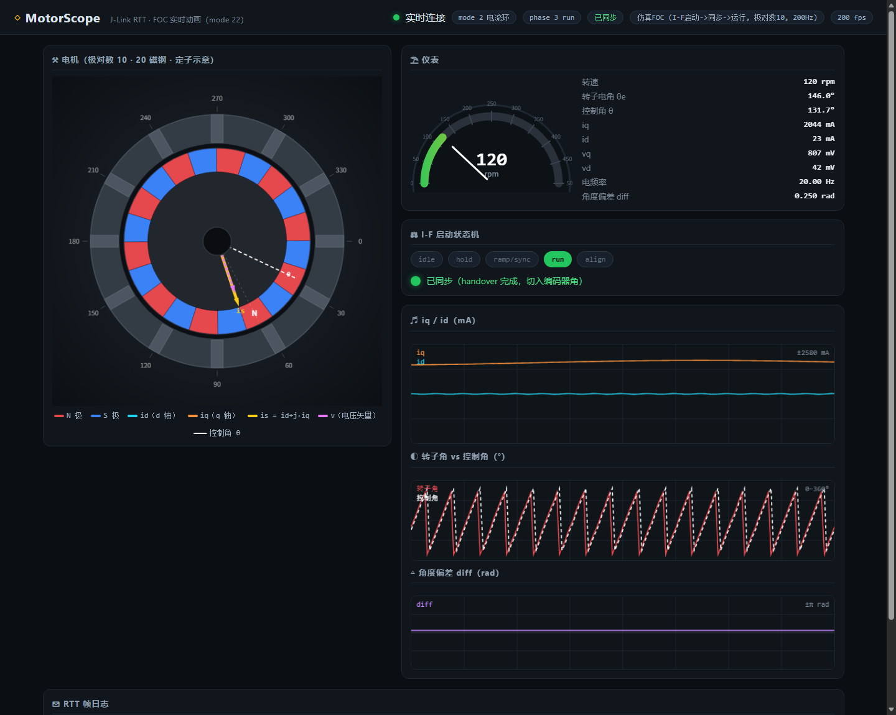

# MotorScope —— J-Link RTT 电机实时动画（FOC，分支 inmop_cur_loop_rtt）

目标固件（`ws/foc.c` 的 Foc_RttSend）由主循环以 **1kHz** 向 RTT 通道 0 发送
MOTF 帧，本工具用 pylink 读取、解析后，在浏览器 Canvas 里**根据真实数据**
实时绘制电机动画：

- 转子：**20 块磁钢（极对数 10）** 按固件直传连续机械角 `mech_mrad` 转动
- **控制角 θ**（I-F 合成角 / RUN 控制角 `g_foc_theta_rad`）白色虚线指针
- **id**（d 轴，青色）/ **iq**（q 轴，橙色）/ **is = id + j·iq**（黄色）矢量
- **电压矢量 v**（vd/vq，品红虚线）
- I-F 状态机：hold → ramp/sync → run（handover），同步灯 + diff 波形
- 转速表、iq/id 波形、转子角 vs 控制角波形、角度偏差波形



## 使用

```powershell
# 仿真（无需硬件，演示 I-F 启动 -> 同步 -> 运行全流程）
python motor_scope.py --mode sim-foc

# J-Link 实机
pip install pylink-square
python motor_scope.py --mode jlink --device HC32F460 --speed-khz 4000
```

启动后自动打开 `http://127.0.0.1:8080/`。

## 数据协议（固件端 `ws/foc.c` 的 Foc_RttSend）

文本帧（`FOC_RTT_RATE_HZ <= 2000`，默认 1000）：

```
MOTF,<mode>,<phase>,<rotor_mrad>,<theta_mrad>,<iq_ma>,<id_ma>,
     <vq_mv>,<vd_mv>,<spd_rpm>,<sync>,<diff_mrad>,<freq_cHz>,<ms>,<mech_mrad>,
     <is_ma>,<is_angle_mrad>,<v_mv>,<v_angle_mrad>,<theta_mech_mrad>,<cnt>
```

| 字段 | 来源 | 说明 |
|------|------|------|
| mode | g_foc_mode | 0=停止 1=开环 2=电流环 3=对齐 |
| phase | g_foc_phase | 0=idle 1=hold 2=ramp/sync 3=run 4=align |
| rotor_mrad | g_foc_if_rotor_rad×1000 | 编码器实测转子电角度 |
| theta_mrad | g_foc_theta_rad×1000 | 控制角（I-F 合成角/RUN 控制角） |
| iq_ma / id_ma | g_foc_iq_ma / g_foc_id_ma | dq 电流反馈 |
| vq_mv / vd_mv | g_foc_vq / g_foc_vd ×1000 | dq 电压 PI 输出 |
| spd_rpm | g_enc_speed_rpm | 转速 |
| sync | g_foc_if_sync | 1 = 已同步（handover） |
| diff_mrad | g_foc_if_diff_rad×1000 | 控制角-转子角偏差 |
| freq_cHz | g_foc_if_freq_hz×100 | I-F 电频率 |
| mech_mrad | g_enc_count×FOC_ENC_DIR 换算 | **固件直传连续机械角**（mrad，不折叠） |
| is_ma | √(id²+iq²) | **固件直传 is 电流矢量幅值**（mA） |
| is_angle_mrad | atan2(iq,id)×1000 | **固件直传 is 相角**（dq 电角度 mrad） |
| v_mv | √(vd²+vq²)×1000 | **固件直传 v 电压矢量幅值**（mV） |
| v_angle_mrad | atan2(vq,vd)×1000 | **固件直传 v 相角**（dq 电角度 mrad） |
| theta_mech_mrad | g_foc_theta_rad/极对数×1000 | **固件直传控制角机械角**（mrad） |
| cnt | g_enc_count | **编码器原始计数**（方向诊断用） |

`FOC_RTT_RATE_HZ > 2000` 时固件自动切换为 **76 字节小端二进制帧**
（magic "MOTF"，字段同上；相较 52B 新增 6 个 int32，二进制末尾依次为 `mech_mrad` + `is_ma`/`is_angle_mrad`/`v_mv`/`v_angle_mrad`/`theta_mech_mrad`/`cnt` 共 7 个 int32），本工具自动识别两种格式。

## 固件端改动（本分支已包含）

1. `ws/foc.c`：`Foc_RttSend()` 由主循环按 `FOC_RTT_RATE_HZ` 节流发送（FOC 未运行时也持续上报）；
   `SEGGER_RTT_Write` 非阻塞，缓冲满丢帧不影响控制环。
2. `RTT/SEGGER_RTT_Conf.h`：`SEGGER_RTT_MAX_NUM_UP_BUFFERS` 3 → 7（启用更多通道；MOTF 帧走通道 0）。
3. 配置宏在 `foc.c` 顶部（`FOC_RTT_ENABLE / FOC_RTT_CH / FOC_RTT_RATE_HZ`，`FOC_RTT_CH` 默认 0，与 `MAIN_D/E` 日志共用通道 0；若用 `MAIN_E()` 打印 MOTF 行，上位机解析器同样兼容），
   可用编译器 `-D` 覆盖；如需统一收口可移入 `motor_config.h`。
4. `motor_config.h` 新增 `MOTOR_SCOPE_KEY`（`g_motor_scope` 默认值，默认 1）。Keil Watch 改 `g_motor_scope`：
   0 = 不发送 MOTF RTT 数据；1 = 发送。MOTF 发送采用"锁"节流（参数见 `motor_config.h` `MOTOR_SCOPE_*`）：
   mode/phase/sync/I-F 事件变化或 spd/|vd|/|vq| 超阈值立即发；id/iq/theta 连续量每 15ms 至多一次；
   无变化时每 300ms 保活一帧（< 工具端断联判定 STALE_MS=400ms）。

## 注意

- 采样率 vs 电频率：fe = rpm/60 × 10。1kHz 帧率在约 3000rpm 以下平滑；
  更高转速建议 `FOC_RTT_RATE_HZ` 提到 2000~4000（自动切二进制帧）。
- I-F 启动阶段 `g_foc_theta_rad` 是合成角，动画会显示"控制角指针"与"转子
  磁钢"分离直到同步——这正是调试 I-F 启动要看的现象。
- `g_foc_if_rotor_rad` 依赖编码器方向/零位（FOC_ENC_DIR / 对齐校准）。
- 机械角由固件直传：`mech_mrad = g_enc_count × g_foc_enc_dir × 2π/ENCODER_CPR × 1000`（连续、不折叠），
  前端示波器/数值面板/电机图直接用该值（`%360` 回绕由前端处理），不再由电角度解卷÷极对数反推。
- is/v 相角为 dq 坐标系内电角度 mrad，前端画布角 = 转子机械角 + dq角/极对数；
  固件在 `Foc_RttSend`（主循环 1kHz）用单精度 sqrtf/atan2f 计算，不进 20kHz ISR。
- 示波器"暂停"时同步冻结缓冲写入与裁剪：新数据不再写入、旧数据不再丢弃，
  冻结窗口可长期回看（点"跟随实时"后恢复滚动）。
- 回看历史（拖动滑块）时，电机剖视图、转速表与数值面板会跟随滑块时刻插值显示，
  与示波器波形一致；"跟随实时"时显示最新帧。


